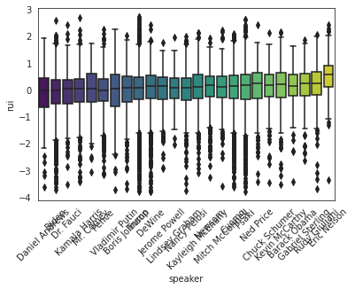
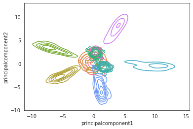
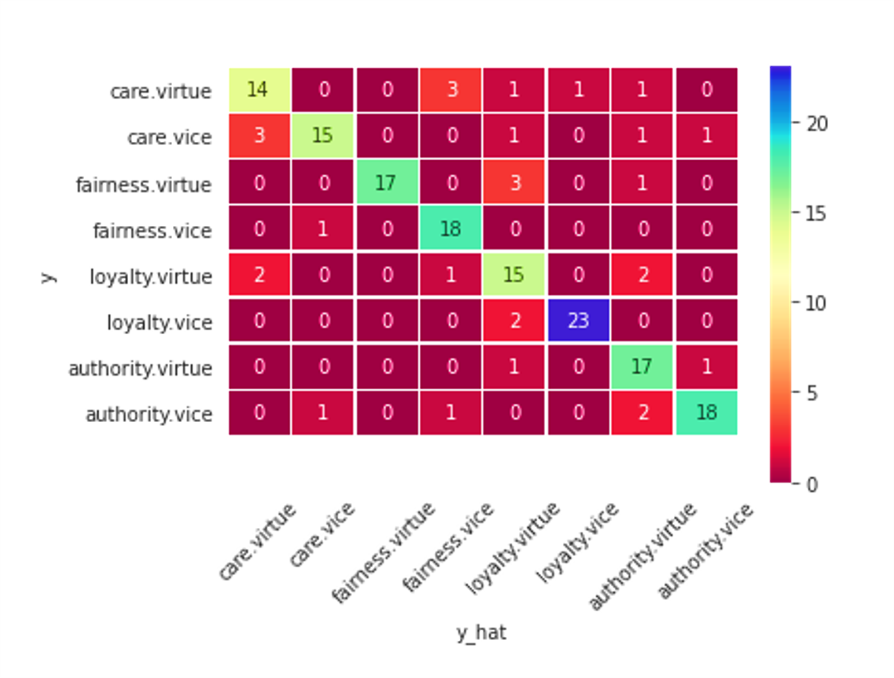
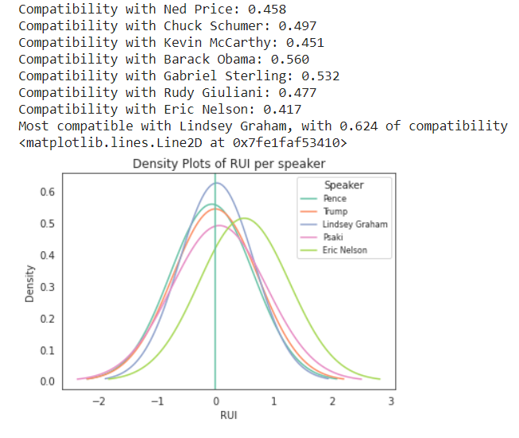

# CAPP 30255: Advanced Machine Learning:Measuring Political Compatibility with node2vec and moral values scale

## Andrei Bartra and Oscar Noriega
--------

## Abstract 

Elections season is characterized by high information variance where much of the opin-ion formation process comes from feedback loops within social networks. In this scenario is difficult to have unbiased tools that at least makes one introspect about the compatibility of your ideas and those of candidates. In this project we propose a tool based on the Rel-ative Universalism Index proposed by [Enke (2020)](https://benjamin-enke.com/pdf/Values_voting.pdf) to compare moral values foundations of users and candidates. To increase the precision of the estimates we propose an extension of the Moral Foundations Dictionary ([MFD 2.0](https://osf.io/ezn37/)) by estimating a word embedding using US political speeches from November 2020 to April 2021 gathered from [rev.com](https://www.rev.com/blog/transcript-category/political-transcripts/page/109).

## Main Document:

[Report](AML_project_report.pdf)

## Sections

1. All the data cleaning, data structure (graph), training (embedding, and neural network), estimation (RUI), and user interface proof of concept are available in the [data_pipeline notebook](data_pipeline.ipynb)

2. The webscrapping code is available in the [ws/ws_rev_webscrapper.py code](ws/ws_rev_webscrapper.py).

3. In the file models we have saved the last version of the [embedding](models/model.model), a [dataframe](models/tagger.csv) with the probability distribution of each word in our corpus and the [neural network model](models/tagger.model).

4. In the [dictionaries file](/dictionaries) there are the Moral foundations dictionaries we use for the project.

## Main results

The project estimates Relative Universalism Indices  for 25 political personalities with the most interventions between november 2020 and april 2021, available in the rev.com platform:

To accomplish that, we trained a node2vec word embedding of the corpus

Then fitted a neural netowork classifier using the MFD 2.0 words, reaching 85% of accuracy:

Finally, a user can fill an open version of the [MFQ](https://moralfoundations.org/wp-content/uploads/files/MFQ30.doc) in the following [link](https://forms.gle/yaBGq9UjkEPmdxim6) to get an estimate of the RUI and compatibility with political personalities.

